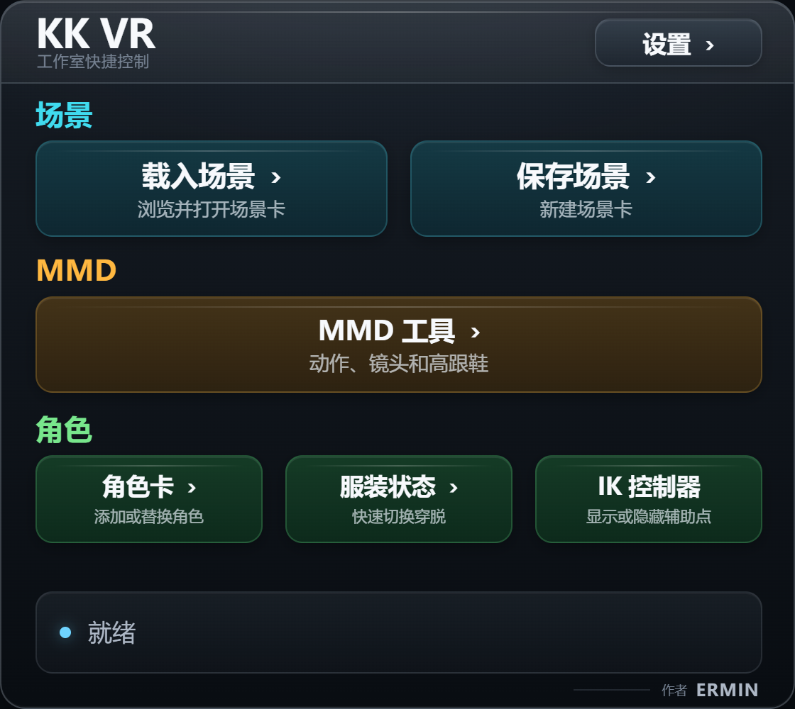

# KKCharaStudioVR: Meta Quest 3 Overhaul Plugin

A customized interaction and physics overhaul plugin for Koikatu (Koikatsu) Chara Studio VR, built on top of the original VRGIN framework. Specially optimized for modern VR headsets, particularly the **Meta Quest 3**.

> [!TIP]
> **Quick Download / 快速下载**:
> You can download the complete pre-configured integration modpack containing BepInEx, patchers, Unity VR support, and our optimized plugin DLL together with a step-by-step setup tutorial directly from the [Releases Page](https://github.com/Ermin610/KK_VR/releases/tag/v0.4.0)!
> 
> 您可以在 [Release 发布页](https://github.com/Ermin610/KK_VR/releases/tag/v0.4.0) 直接一键下载包含 BepInEx、补丁加载器、Unity VR 支持、我们重构优化后的最新 DLL 以及**完整三语步骤教程**的整包！

This plugin transforms the studio VR control feeling from clunky legacy wand controls into a premium, responsive, and immersive experience similar to **Virt-A-Mate (VaM)** and **VRChat**.

---

## 🚀 Key Features

### 1. Premium Virtual Hands & Realistic Finger Curling
- **translucent Virtual Hands**: Replaced generic SteamVR controller wands with beautiful, customized hand models indicating exact physical collision boundaries.
- **Natural Resting Curve**: Fingers naturally curve at a relaxed posture when not performing actions, rather than staying rigidly straight.
- **Quest 3 Grip Alignment**: Tailored hand orientations with a **-40° pitch offset**, perfectly matching the Meta Quest 3 controller grip angle.
- **Proportional Joint Curling**: Implemented realistic finger curling (decreasing curl angles from proximal to distal joints) instead of uniform robotic joint bending, providing a premium "alive" hand feeling.

### 2. VAM-Style Soft Physics (DynamicBone Integration)
- **Soft-Body Interactions**: Attached high-performance sphere colliders to the virtual hands (palms and fingers), allowing realistic, physical soft-body collisions with characters' hair, skirts, clothes, and any other `DynamicBone`-driven objects in the scene.
- **Adjustable Physics**: Customize the hand collision radius dynamically in the settings GUI.

### 3. Smart Proximity Grab & Haptic Feedback
- **Proximity Detection**: Effortlessly grab character IK targets (hands, feet, head, hip, etc.) when your hand is near, without requiring millimeter-precise overlaps.
- **Visual Tether (Grab Line)**: A smooth, color-shifting 3D line connects your hand to the target during grab (Green when close, Yellow at medium range, Orange when stretched).
- **Visual Breathing Pulse**: Nearby targets display a subtle green breathing pulse animation indicating they are ready to be grabbed.
- **Haptic Vibration**: High-fidelity haptic pulses trigger on your VR controllers when a grab is initiated or released, providing immersive physical feedback.


*Realize controlling IK and adjusting position in KK / 实现在KK中控制IK调整位置*

### 4. Smooth Locomotion & Comfort Vignette
- **Left Stick Walk**: Smooth locomotion in any direction using the left joystick (speed customizable).
- **Right Stick Turn**: Choose between smooth turning (adjustable speed) or snap turning (customizable angle and cooldown).
- **Right Stick Height (Y-Axis)**: Push the right stick Up/Down to smoothly raise or lower your height (Y-axis vertical position), completely replacing clunky grip-dragging.
- **Comfort Vignette (Anti-Motion-Sickness)**: A beautiful cinematic vignette automatically fades in at the edges of your vision during movement, keeping your peripheral vision stable and eliminating motion sickness. Clear radius is customizable.

### 5. High-Performance Desktop Blackout (Privacy Mode)
- **Instant Toggle**: Press **Spacebar** on your keyboard or click **Cover Desktop View** in the VR settings panel to completely black out the flat monitor display on your PC.
- **0% VR UI Interference**: Uses a specialized high-priority render-pass Camera (`depth = 99999f`, `cullingMask = 0`, `clearFlags = Color.black`) that directly clears the PC display buffer without using Canvas or IMGUI. The VR headset and its UI panels are **100% unaffected** and fully interactive.
- **Boosted VR Frame Rate**: Toggling privacy mode disables Unity's VR screen mirroring (`VRSettings.showDeviceView = false`), saving significant GPU/CPU rendering resources on the computer.

### 6. Robust UI & Laser Controls
- **Unified Settings Panel**: Merged settings into a single static `GUIQuad` shared across both controllers, preventing duplicate window bugs.
- **Accurate Laser Raycasting**: Realigned the interaction laser directly with the controller forward direction (instead of the rotated hands' finger forward) to ensure laser interaction with UI dropdowns and sliders is 100% accurate.
- **Native Popup Compatibility**: Studio option, graphics, confirmation, and other initially hidden panels are captured when they open, with visual sorting order preserved for reliable laser clicks.

### 7. Compact Wrist Quick Menu
- **Three-language interface**: Simplified Chinese is the default, with Japanese and English available under Settings > General. The selected language applies immediately and persists across launches.
- **Focused submenus**: Scene commands, character cards, clothing presets, and MMD controls stay organized in the compact wrist interface.
- **Native scene previews**: Scene Load opens Studio's original large scene browser so card thumbnails remain visible; Scene Save keeps its focused wrist page.
- **Separate MMDD workflows**: KK VR does not replace MMDD's desktop UI or its configured file-dialog behavior; the wrist VMD browser is a separate fully in-headset workflow that remembers the motion root selected by the user.
- **Guided wrist VMD loading**: The wrist browser distinguishes motion and camera metadata, asks for a target character when Studio has none selected, prompts for a related camera, and automatically matches nearby audio.
- **MMDD VR controls**: The MMD submenu exposes play/pause, Fixed FOV on/off and value adjustment, plus MMDD's original automatic/manual high-heels controls with an in-wrist scene-character picker.
- **Timeline control space**: Timeline has its own wrist page and right-stick transport. Click the right stick to play or pause; vertical input adjusts framing, while holding Grip changes vertical position and applies continuous linear yaw. The current FOV/height/yaw setup can be saved, loaded, or reset from the wrist page.
- **Character-card preview**: Selecting a female or male card opens its real card image on a dedicated wrist page. Buttons below the image either load it as a new character or open an in-wrist same-sex scene-character picker before replacement.
- **Outfit-card preview and hair-safe replacement**: Browse real coordinate-card thumbnails from `UserData\coordinate`, choose a scene character, then load clothing only, append every source accessory to empty slots, or pick individual source accessories to append. These normal modes preserve all occupied accessory slots, including accessory-based hair. If Coordinate Load Option, MaterialEditor, or other extension data is bound to exact accessory slots, KK VR shows a risk confirmation before using the separate exact-slot compatibility path; every operation is snapshot-backed for rollback and undo.
- **Studio settings in VR**: The Settings submenu changes the camera background preset (including an exact RGB `0, 180, 0` green screen), character-light state/intensity/shadow/color, and Master/BGM/Environment/System/Game audio without opening Studio's obstructed desktop panels.
- **Thumbstick browsing**: Move the right thumbstick up or down to scroll long file lists without leaving VR.
- **Input isolation**: While the menu is open, the right trigger controls only the wrist menu; object grabbing, GUI laser input, and two-hand scaling resume when it closes.



### 8. Optional Timeline Camera Follow
- [KK VR Camera Sync](https://github.com/YukyoMoe/KK_VR_CameraSync) can be installed as a separate companion plugin so the VR origin follows final Studio camera motion, including Timeline camera tracks.
- The companion remains separate from the core DLL, so camera-follow behavior can be disabled or removed without changing hand tracking, laser input, or wrist-menu positioning.
- Camera Sync `0.2.3` detects Timeline playback without a hard dependency, rebuilds the VR origin from one absolute camera-local anchor, converts animated desktop FOV into bounded distance compensation, and applies the saved height/yaw offsets without accumulating drift.
- Generic Studio movement remains on the conservative tracked defaults outside Timeline playback, and each Timeline-specific behavior has its own config switch for rollback.

## Optional Integrations & Upstream Credits

KK VR adds an in-headset control and compatibility layer for the independently developed projects below. **MMDD and VNGE are not created, modified, or bundled by this repository**; install their Koikatu releases separately before using the wrist MMD features.

- **MMD Director (MMDD)** — created by [Countd360](https://www.patreon.com/c360plugins). See the [official MMD Director page](https://www.patreon.com/posts/mmd-director-pv-55604378) and [MMDD 2.9.6 release](https://www.patreon.com/posts/mmdd-v2-9-6-160423639). MMDD remains responsible for loading and playing VMD motion, expressions, camera, and audio; KK VR adds the headset file browser, scene-character selection, play/pause, Fixed FOV, and high-heels controls.
- **VN Game Engine (VNGE)** — originally created by [Keitaro / KeiPlugins](https://www.patreon.com/KeiPlugins). Countd360 is an important contributor and maintains later releases; [Countd360's VNGE release page](https://www.patreon.com/posts/vnge-release-92082611) records that attribution. KK VR uses VNGE as the runtime bridge to MMDD rather than embedding either project.
- **Installation and compatibility** — follow Countd360's [VNGE and MMDD installation guide](https://www.patreon.com/posts/vnge-and-mmdd-94912633), including its upstream dependencies, and choose the packages made for KK. The current development and test environment is **MMDD 2.9.6 + VNGE 44.0**; MMDD labels 2.9.6 as a pre-3.0 test release, and compatibility with every older or future version is not implied.
- **High-heels prerequisite** — select a character that already has an MMDD motion controller loaded from a motion VMD. MMDD must also detect a supported KK high-heels integration: Stiletto/KK_Stiletto, or BonerStateSync together with KKABMX.
- **Coordinate Load Option** — created by Jim Chen; see the [official Coordinate Load Option page](https://xn--jgy.tw/Koikatu/coordinate-load-option/). When installed and selective loading is safe, KK VR uses a soft compatibility bridge to its existing pipeline so clothing/accessory MaterialEditor and KCOX data can follow while its hair-accessory lock remains active. No Coordinate Load Option source is copied or bundled here. If it is absent, incompatible, or accessory-bound extension data is detected, Smart Replace independently falls back to clothing-only loading and keeps all current accessories.

---

## 🎮 Controller Layout (Meta Quest 3)

| Control | Action |
|:---|:---|
| **Left Joystick** | Smooth Movement (WASD-style walk) |
| **Right Joystick (Left/Right, outside Timeline)** | Smooth Turn / Snap Turn |
| **Right Joystick (Up/Down, outside Timeline)** | Adjust Height (Vertical Y-Axis movement) |
| **Right Joystick (Up/Down, Timeline playing)** | Adjust Timeline front/back framing |
| **Right Grip + Right Joystick (Up/Down)** | Linearly adjust Timeline vertical offset |
| **Right Grip + Right Joystick (Left/Right)** | Linearly adjust Timeline yaw offset |
| **Right Joystick (Wrist file browser)** | Scroll the current file list |
| **Grip (Middle Finger)** | Grab character IK targets / Drag UI panels |
| **Trigger (Index Finger)** | Click VR UI / Select objects in workspace |
| **A Button** | Toggle all GUI visibility |
| **X Button (short press)** | Open / close the wrist quick menu |
| **IK button (Wrist menu)** | Show / hide IK controls |
| **Timeline button (Wrist menu)** | Start / pause Timeline |
| **Left Joystick Click (Press)** | Toggle MMDD play / pause |
| **Left Grip + Left Joystick Click** | Summon the main GUI in front of your head |
| **Right Joystick Click (Timeline context)** | Play / pause Timeline and claim its control space |
| **Right Joystick Click (Timeline unavailable)** | Undo last action in Studio |
| **Keyboard Spacebar** | Toggle Desktop Blackout Cover (Privacy / Performance Mode) |

---

## 🛠️ Installation & Setup

### Requirements
- **Koikatsu / Koikatu (Koikatsu Party)** with **Chara Studio**.
  > [!IMPORTANT]
  > This plugin is designed for fully modded game clients. If you are missing any essential base plugins, dependency mods, or standard configurations, please supplement your game installation using the official **HF Patch** (a comprehensive, easy-to-use modpack and patcher for Koikatsu).
  > - **Official HF Patch Repository**: [ManlyMarco/KK-HF_Patch](https://github.com/ManlyMarco/KK-HF_Patch)
- **BepInEx** (v5.x recommended).
- **OpenVR / SteamVR** runtime active.
- **VNGE + MMD Director** (optional; required only for the wrist MMD/VMD/MMDD controls; install separately using the upstream guide above).
- **Timeline 1.5.x** (optional; required for Timeline transport and its VR camera control space).

### Installation
1. Download the complete release package.
2. Place `KKCharaStudioVRPlugin.dll` under `Koikatu3\BepInEx\`, replacing the previous KK VR DLL in that same location. Do not keep a second copy under `BepInEx\plugins`.
3. Place `KKVRReShadeBridge.addon64` next to `CharaStudio.exe`. This native add-on is required only for the built-in ReShade switch and preset selector, but it must be present before Studio starts because ReShade cannot discover it later.
4. Start the game in VR mode.

### Starting normal Studio without OpenVR

Use `StartCharaStudioNoVR.bat` from the game root. The release package enables
VR support in `globalgamemanagers` so the VR/ReShade path can initialize before
D3D11; consequently `--novr` alone is too late to stop Unity's native OpenVR
bootstrap. The launcher supplies both required gates:

```text
CharaStudio.exe --novr -vrmode None
```

`-vrmode None` prevents `openvr_api.dll` from entering the process at Unity
startup, while `--novr` prevents the managed VR loader and CameraSync patches
from activating. No files are renamed or swapped, and the existing VR launcher
continues to use the original early OpenVR/ReShade path.

Use `StartCharaStudioVR.bat` for VR. It explicitly supplies `-vrmode OpenVR`
and `--studiovr`; simply having SteamVR open no longer changes a normal Studio
launch into VR.

For Timeline camera-follow support, install the optional
[`KK_VR_CameraSync.dll`](https://github.com/YukyoMoe/KK_VR_CameraSync)
under `BepInEx\plugins\KK_VR_CameraSync\`. It is intentionally not merged into
the core plugin so it can be tested and rolled back independently.

### Configuration
Access the settings menu inside VR or on the desktop window to customize:
- Locomotion & turning speeds.
- Snap turn angles.
- Hand model visibility, transparency, and scaling offsets.
- DynamicBone collider radius.
- Comfort Vignette toggle and clear radius.
- Wrist quick menu enable and scale.
- Wrist Studio background, character-light, and audio controls.

---

## 👨‍💻 Development Notes

This repository contains the heavily decompiled and modernized source code of the Chara Studio VR plugin. Built and compiled with Microsoft MSBuild targeting .NET 3.5 framework for Unity 5.x / 2017.x compatibility.

### Building from Source
Release builds require Visual Studio 2022 with the **Desktop development with C++** workload and a Windows SDK. The main project builds the managed plug-in and native ReShade bridge together; it intentionally fails when the C++ toolchain is missing so an incomplete package is not mistaken for a release.

Run the release staging script in the repository root:
```powershell
.\build-release.ps1 -GameDir "E:\Koikatu3"
```
The default staged layout is under `output\release`: the managed DLL is placed under `BepInEx\`, matching the existing KK VR installation layout, while `KKVRReShadeBridge.addon64` is placed at the package root next to `CharaStudio.exe`.

For an explicitly managed-only development build, pass `/p:BuildNativeReShadeBridge=false`. MSBuild emits a warning because that output cannot provide the ReShade controls and is not release-ready.

---

*Note: This plugin is a continuous community iteration aimed at modernizing the legendary Koikatu VR experience. Contributions, pull requests, and bug reports are welcome!*
