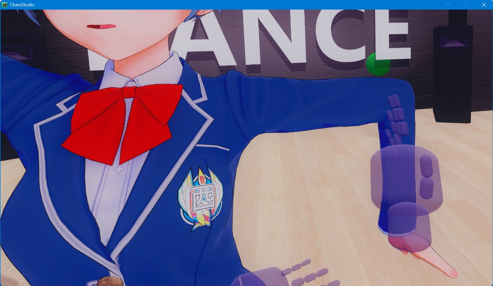

# KKCharaStudioVR: Meta Quest 3 Overhaul Plugin

A customized interaction and physics overhaul plugin for Koikatu (Koikatsu) Chara Studio VR, built on top of the original VRGIN framework. Specially optimized for modern VR headsets, particularly the **Meta Quest 3**.

> [!TIP]
> **Quick Download / 快速下载**:
> You can download the complete pre-configured integration modpack containing BepInEx, patchers, Unity VR support, and our optimized plugin DLL together with a step-by-step setup tutorial directly from the [Releases Page](https://github.com/Ermin610/KK_VR/releases/tag/v0.2.0)!
> 
> 您可以在 [Release 发布页](https://github.com/Ermin610/KK_VR/releases/tag/v0.2.0) 直接一键下载包含 BepInEx、补丁加载器、Unity VR 支持、我们重构优化后的最新 DLL 以及**完整三语步骤教程**的整包！

This plugin transforms the studio VR control feeling from clunky legacy wand controls into a premium, responsive, and immersive experience similar to **Virt-A-Mate (VaM)** and **VRChat**.

---

## 🚀 Key Features

### 1. Premium Virtual Hands & Realistic Finger Curling
- **translucent Virtual Hands**: Replaced generic SteamVR controller wands with beautiful, customized hand models indicating exact physical collision boundaries.
- **Natural Resting Curve**: Fingers naturally curve at a relaxed posture when not performing actions, rather than staying rigidly straight.
- **Quest 3 Grip Alignment**: Tailored hand orientations with a **-40° pitch offset**, perfectly matching the Meta Quest 3 controller grip angle.
- **Proportional Joint Curling**: Implemented realistic finger curling (decreasing curl angles from proximal to distal joints) instead of uniform robotic joint bending, providing a premium "alive" hand feeling.

### 2. VAM-Style Soft Physics (DynamicBone Integration)
- **Soft-Body Interactions**: Attached high-performance sphere colliders to the virtual hands (palms and fingers), allowing realistic, physical soft-body collisions with characters' hair, skirts, clothes, and any other `DynamicBone`-driven objects in the scene.
- **Adjustable Physics**: Customize the hand collision radius dynamically in the settings GUI.

### 3. Smart Proximity Grab & Haptic Feedback
- **Proximity Detection**: Effortlessly grab character IK targets (hands, feet, head, hip, etc.) when your hand is near, without requiring millimeter-precise overlaps.
- **Visual Tether (Grab Line)**: A smooth, color-shifting 3D line connects your hand to the target during grab (Green when close, Yellow at medium range, Orange when stretched).
- **Visual Breathing Pulse**: Nearby targets display a subtle green breathing pulse animation indicating they are ready to be grabbed.
- **Haptic Vibration**: High-fidelity haptic pulses trigger on your VR controllers when a grab is initiated or released, providing immersive physical feedback.


*Realize controlling IK and adjusting position in KK / 实现在KK中控制IK调整位置*

### 4. Smooth Locomotion & Comfort Vignette
- **Left Stick Walk**: Smooth locomotion in any direction using the left joystick (speed customizable).
- **Right Stick Turn**: Choose between smooth turning (adjustable speed) or snap turning (customizable angle and cooldown).
- **Right Stick Height (Y-Axis)**: Push the right stick Up/Down to smoothly raise or lower your height (Y-axis vertical position), completely replacing clunky grip-dragging.
- **Comfort Vignette (Anti-Motion-Sickness)**: A beautiful cinematic vignette automatically fades in at the edges of your vision during movement, keeping your peripheral vision stable and eliminating motion sickness. Clear radius is customizable.

### 5. High-Performance Desktop Blackout (Privacy Mode)
- **Instant Toggle**: Press **Spacebar** on your keyboard or click **Cover Desktop View** in the VR settings panel to completely black out the flat monitor display on your PC.
- **0% VR UI Interference**: Uses a specialized high-priority render-pass Camera (`depth = 99999f`, `cullingMask = 0`, `clearFlags = Color.black`) that directly clears the PC display buffer without using Canvas or IMGUI. The VR headset and its UI panels are **100% unaffected** and fully interactive.
- **Boosted VR Frame Rate**: Toggling privacy mode disables Unity's VR screen mirroring (`VRSettings.showDeviceView = false`), saving significant GPU/CPU rendering resources on the computer.

### 6. Robust UI & Laser Controls
- **Unified Settings Panel**: Merged settings into a single static `GUIQuad` shared across both controllers, preventing duplicate window bugs.
- **Accurate Laser Raycasting**: Realigned the interaction laser directly with the controller forward direction (instead of the rotated hands' finger forward) to ensure laser interaction with UI dropdowns and sliders is 100% accurate.

### 7. Compact Wrist Quick Menu
- **Focused submenus**: Scene cards, character cards, clothing presets, and MMD controls stay inside the compact wrist interface.
- **Single-click scene workflow**: Scene Load opens a scene-card browser that filters out ordinary PNG renders; Scene Save opens a dedicated save page.
- **Direct MMDD loading**: The VMD browser starts at `E:\action`, distinguishes motion and camera files from their metadata, prompts for a related camera after motion selection, and automatically matches nearby audio.
- **Native character-card actions**: Add female or male cards and replace the currently selected character using Studio's built-in operations.
- **Thumbstick browsing**: Move the right thumbstick up or down to scroll long file lists without leaving VR.
- **Input isolation**: While the menu is open, the right trigger controls only the wrist menu; object grabbing, GUI laser input, and two-hand scaling resume when it closes.

---

## 🎮 Controller Layout (Meta Quest 3)

| Control | Action |
|:---|:---|
| **Left Joystick** | Smooth Movement (WASD-style walk) |
| **Right Joystick (Left/Right)** | Smooth Turn / Snap Turn |
| **Right Joystick (Up/Down)** | Adjust Height (Vertical Y-Axis movement) |
| **Right Joystick (Wrist file browser)** | Scroll the current file list |
| **Grip (Middle Finger)** | Grab character IK targets / Drag UI panels |
| **Trigger (Index Finger)** | Click VR UI / Select objects in workspace |
| **A Button** | Toggle all GUI visibility |
| **X Button** | Toggle IK controls |
| **Left Menu Button (short press)** | Open / close the wrist quick menu |
| **Left Joystick Click (Press)** | Toggle MMDD play / pause |
| **Left Grip + Left Joystick Click** | Summon the main GUI in front of your head |
| **Right Joystick Click (Press)** | Undo last action in Studio |
| **Keyboard Spacebar** | Toggle Desktop Blackout Cover (Privacy / Performance Mode) |

---

## 🛠️ Installation & Setup

### Requirements
- **Koikatsu / Koikatu (Koikatsu Party)** with **Chara Studio**.
  > [!IMPORTANT]
  > This plugin is designed for fully modded game clients. If you are missing any essential base plugins, dependency mods, or standard configurations, please supplement your game installation using the official **HF Patch** (a comprehensive, easy-to-use modpack and patcher for Koikatsu).
  > - **Official HF Patch Repository**: [ManlyMarco/KK-HF_Patch](https://github.com/ManlyMarco/KK-HF_Patch)
- **BepInEx** (v5.x recommended).
- **OpenVR / SteamVR** runtime active.

### Installation
1. Download the latest compiled release `KKCharaStudioVRPlugin.dll`.
2. Place the DLL file in your game directory under `Koikatu3\BepInEx\plugins\` (or directly under BepInEx folder).
3. Start the game in VR mode.

### Configuration
Access the settings menu inside VR or on the desktop window to customize:
- Locomotion & turning speeds.
- Snap turn angles.
- Hand model visibility, transparency, and scaling offsets.
- DynamicBone collider radius.
- Comfort Vignette toggle and clear radius.
- Wrist quick menu enable and scale.

---

## 👨‍💻 Development Notes

This repository contains the heavily decompiled and modernized source code of the Chara Studio VR plugin. Built and compiled with Microsoft MSBuild targeting .NET 3.5 framework for Unity 5.x / 2017.x compatibility.

### Building from Source
Run the following MSBuild command in the repository root:
```powershell
& "MSBuild.exe" "KKCharaStudioVRPlugin\KKCharaStudioVRPlugin.csproj" /p:Configuration=Release
```
The compiled DLL will be located under `KKCharaStudioVRPlugin\bin\Release\net35\KKCharaStudioVRPlugin.dll`.

---

*Note: This plugin is a continuous community iteration aimed at modernizing the legendary Koikatu VR experience. Contributions, pull requests, and bug reports are welcome!*
