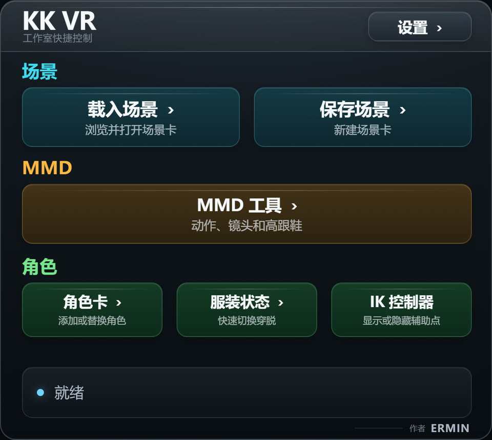

# 【原创插件／更新】KK CharaStudio VR v0.0.14——少摘几次头显，安稳地待在二次元里

这次 v0.0.14 主要没有去堆新奇功能，而是继续收拾 CharaStudio VR 里最影响使用节奏的几个地方。

戴着头显做场景时，最难受的往往不是功能没有，而是很多操作明明就在眼前，却还是得掀开头显、切回桌面、找到窗口再点一下。来回折腾几次以后，沉浸感基本也就被现实世界拖走了（笑）。

所以这一版的方向很简单：**能留在 VR 里完成的事情，就尽量不再让人回桌面。**

## MMD 播放现在可以直接在 VR 里操作

MMD 的常用控制已经整理进腕表菜单。读取动作、选择角色、处理镜头以及播放／暂停，都可以直接在 VR 内完成。

平时观看时，**直接按下左摇杆就能快捷播放或暂停 MMD**。不需要再为了点一下播放，特意切回桌面寻找 MMDD 窗口。动作目录选择一次后会自动记住，之后换动作也可以继续在腕表里浏览。

## Timeline 镜头进行了 VR 视角补正

Timeline 播放时，桌面相机的运动会针对 VR 视角进行补正。镜头移动、旋转和视野变化在头显里会更自然，不会再像单纯把桌面相机生硬地套到脸上。

这样播放已经做好的 Timeline 场景时，可以直接留在 VR 中观看，整个过程连贯不少。

## 内置读取和换装操作更方便

场景卡、角色卡和 VMD 文件都加入了更适合 VR 使用的内置浏览流程。角色卡可以先看卡面，再决定添加新角色或替换场景中的角色；文件较多时，也能直接用右摇杆上下翻动列表。

换装操作也放进了腕表菜单，可以选择场景角色并快速切换各部位的穿脱状态，不必再隔着头显寻找桌面上的小按钮。

## 基本操作

短按左手柄 **X 键**打开或关闭腕表菜单，使用右手射线指向，扣下扳机确认；浏览文件列表时，用右摇杆上下翻页。需要快速控制 MMD 时，按下左摇杆即可播放／暂停。

菜单支持简体中文、日本語和 English，切换后立即生效，下次启动也会保留。

## 使用前说明

- 本帖附件是 **v0.0.14 插件更新包**，需要原本已经可以正常进入 CharaStudio VR 的环境。
- 当前主要使用 **Quest 3＋SteamVR** 测试，其他 OpenVR 手柄的按键映射可能会有差异。
- MMD 与 Timeline 相关功能需要已经安装对应插件；没有安装时不会影响腕表里的其他功能。

## 安装

退出 CharaStudio 后，将附件解压到游戏根目录并覆盖旧版即可。建议先备份旧 DLL，方便遇到兼容问题时换回。

最终文件位置：

`BepInEx\plugins\KKCharaStudioVRPlugin.dll`

下载：**见本帖附件 `KKCharaStudioVRPlugin_v0.0.14.zip`**

项目地址：https://github.com/Ermin610/KK_VR

总之，这次更新追求的不是“功能看起来很多”，而是让 MMD、Timeline、读取和换装这些常用操作真正适合戴着头显去用。能少回几次桌面，多陪自家女儿待一会儿，这版就算没有白改。

如果使用时遇到问题，欢迎在楼下留言反馈。

作者：**ERMIN**
